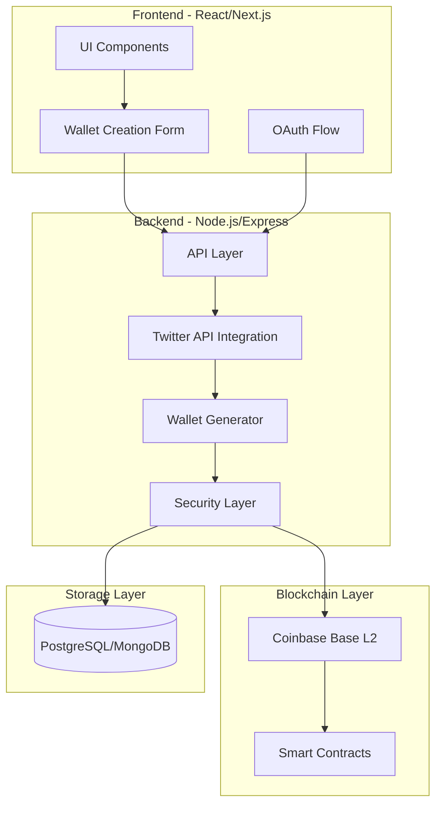
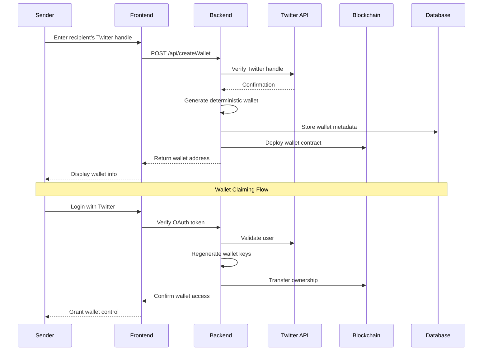

# SocialFi: Social-to-Crypto Onboarding Platform

A non-custodial crypto onboarding platform built on Coinbase Base L2 that enables users to create and send crypto wallets using social media handles.

## System Architecture



## Wallet Creation and Claiming Flow



## Technical Components

### Frontend (React/Next.js)

The frontend is built using React with Next.js and implements a modern, responsive design using Tailwind CSS. Key components include:

```typescript
// Example WalletForm Component Structure
const WalletForm = () => {
  const [twitterHandle, setTwitterHandle] = useState('');

  const handleSubmit = async () => {
    const wallet = await createWallet(twitterHandle);
    // Handle wallet creation
  };

  return (
    <form onSubmit={handleSubmit}>
      <input 
        type="text"
        value={twitterHandle}
        onChange={(e) => setTwitterHandle(e.target.value)}
        placeholder="@username"
        className="w-full pl-10 pr-4 py-3 border rounded-xl"
      />
      <button type="submit">Create Wallet</button>
    </form>
  );
};
```

### Backend Architecture (Node.js/Express)

The backend implements a secure API layer with the following key features:

```typescript
// Example Wallet Generation Service
import crypto from 'crypto';
import { Wallet } from 'ethers';

class WalletService {
  private readonly salt: string;

  constructor(salt: string) {
    this.salt = salt;
  }

  generateWallet(twitterHandle: string): Wallet {
    const hmac = crypto.createHmac('sha256', this.salt);
    hmac.update(twitterHandle);
    const privateKeyHex = hmac.digest('hex');
    return new Wallet(privateKeyHex);
  }
}
```

### Database Schema

```sql
-- Example Database Schema
CREATE TABLE wallet_associations (
  id SERIAL PRIMARY KEY,
  twitter_handle VARCHAR(255) NOT NULL UNIQUE,
  wallet_address VARCHAR(42) NOT NULL,
  created_at TIMESTAMP DEFAULT CURRENT_TIMESTAMP,
  claimed_at TIMESTAMP,
  CONSTRAINT valid_ethereum_address CHECK (wallet_address ~ '^0x[a-fA-F0-9]{40}$')
);

CREATE INDEX idx_twitter_handle ON wallet_associations(twitter_handle);
```

## Security Implementation

### Deterministic Wallet Generation

The platform uses HMAC-SHA256 for deterministic wallet generation:

```typescript
const generateWallet = (handle: string, salt: string): string => {
  const hmac = crypto.createHmac('sha256', salt);
  hmac.update(handle);
  return hmac.digest('hex');
};
```

Key security features:
- No private key storage
- Deterministic generation using Twitter handle + salt
- Memory-only private key handling
- Secure salt management

### OAuth Flow

1. User initiates Twitter login
2. Backend validates OAuth token
3. Generate wallet access using validated identity
4. Implement secure session management

## API Documentation

### Endpoints

#### POST /api/createWallet

Creates a new wallet for a Twitter handle.

Request:
```json
{
  "twitterHandle": "string"
}
```

Response:
```json
{
  "address": "string"
}
```

### Error Handling

```typescript
interface APIError {
  code: number;
  message: string;
  details?: any;
}

// Example error response
{
  "error": {
    "code": 400,
    "message": "Invalid Twitter handle format",
    "details": {
      "handle": "@invalid!handle"
    }
  }
}
```

## Development Setup

1. Clone and install dependencies:
```bash
git clone https://github.com/your-org/socialfi.git
cd socialfi

# Frontend setup
cd frontend
npm install

# Backend setup
cd ../backend
npm install
```

2. Configure environment variables:
```bash
# .env file
TWITTER_BEARER_TOKEN=your_twitter_api_token
SALT=your_secure_salt
PORT=5000
```

3. Start development servers:
```bash
# Frontend
npm run dev

# Backend
npm run dev
```

## Testing

```bash
# Run all tests
npm run test

# Run specific test suite
npm run test:wallet
npm run test:api
npm run test:e2e
```

## Deployment

### Frontend Deployment (Vercel)

1. Connect GitHub repository
2. Configure environment variables:
   - `NEXT_PUBLIC_API_URL`
   - `NEXT_PUBLIC_TWITTER_CLIENT_ID`
3. Deploy

### Backend Deployment

1. Prepare Node.js environment
2. Set up SSL certification
3. Configure environment variables
4. Start server using PM2:
```bash
pm2 start npm --name "socialfi-api" -- start
```

## Monitoring and Maintenance

### Health Checks

```typescript
// Example health check endpoint
app.get('/health', async (req, res) => {
  try {
    // Check database connection
    await db.query('SELECT 1');
    
    // Check Twitter API
    await twitterClient.verifyCredentials();
    
    res.status(200).json({ status: 'healthy' });
  } catch (error) {
    res.status(500).json({ status: 'unhealthy', error });
  }
});
```

### Logging

```typescript
// Example logging middleware
const loggerMiddleware: RequestHandler = (req, res, next) => {
  console.log(`${new Date().toISOString()} - ${req.method} ${req.path}`);
  next();
};
```

## Contributing

1. Fork the repository
2. Create feature branch
3. Commit changes
4. Push to branch
5. Create Pull Request

## License

MIT License

---

Created with ❤️ by SocialFi Team